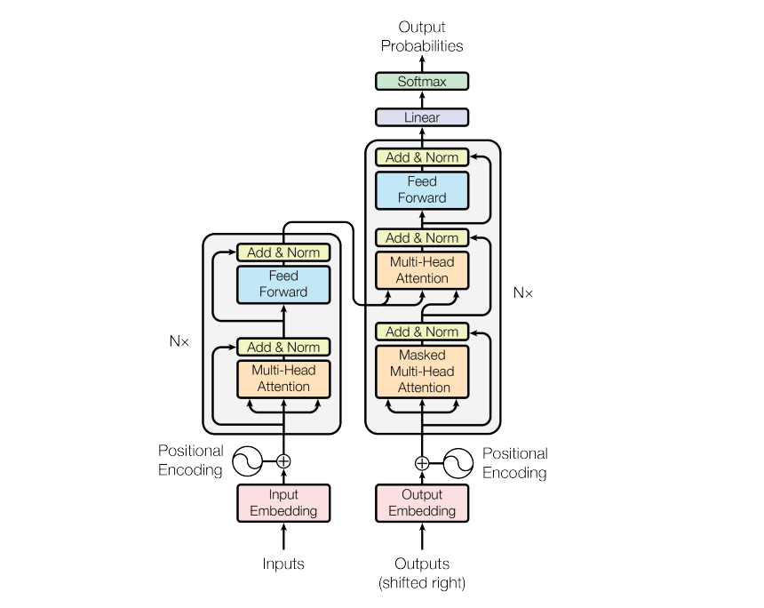
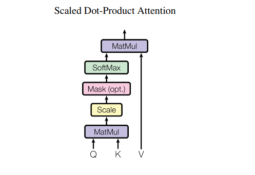
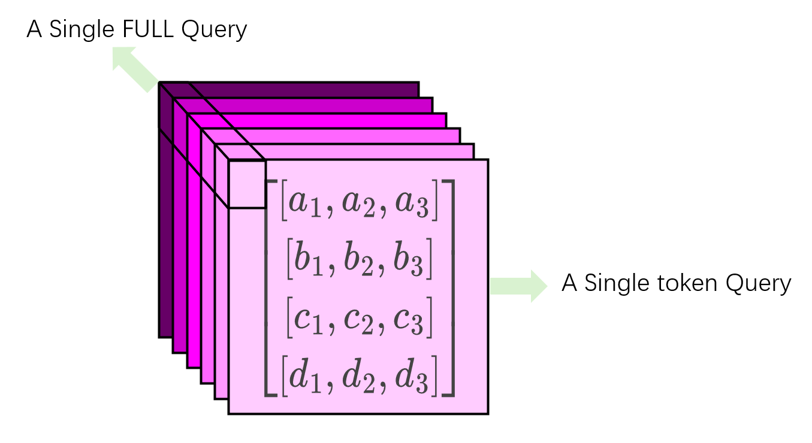
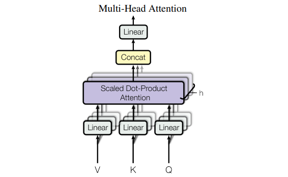
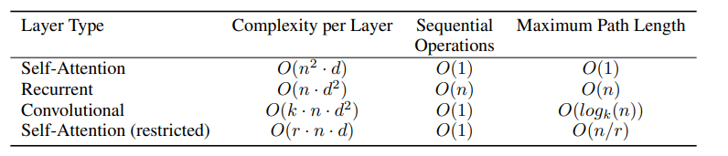

#  Chap0.3 Transformer

## Attention is all you need

**主流的序列传导模型基于复杂的循环或卷积神经网络(编码器-解码器架构)**

>   Transformer基于注意力机制,省去了循环和卷积

**RNN通常根据输入和输出序列的符号位置来分解计算**

>   生成一个隐藏状态(hidden state)$`ht`$,是前一个隐藏状态$`h_{t-1}`$和位置t作为输入的函数
>
>   **这种固有的顺序性阻碍了训练样本的并行化(在长序列十分重要)**
>
>   最近的研究通过分解技巧和条件计算显著提升了计算效率，同时在条件计算的情况下也提升了模型性能。然而，顺序计算的基本约束依然存在。(无效改进)
>
>   >分解技巧:降低序列模型需要计算的依赖关系(减少计算量)
>   >
>   >>   分解概率/矩阵分解/分块等
>   >
>   >条件计算:在推理时并不总是激活所有参数,而是动态选择(稀疏计算)
>   >
>   >>   `MoE`/门控机制/条件跳过

## 0.`Transformer`



## 1.`Transformer`Encoder and Decoder 

**1.Encoder**

>   作用:深度理解输入序列(根据整个句子的上下文)
>
>   方法:使用自注意力
>
>   对一对token处理后,生成两个完全不同富含上下文西悉尼的向量表示

整个编码器是由6个完全相同的Layer堆叠而成。

每一层包含两个子层：一个多头自注意力层和一个简单的、按位置进行的全连接前馈网络。

所以每个子层的输出是:`LayerNorm(x+Sublayer(x))`(一种残差连接)

>   细节1:这里的自注意力是双向的,可以自由关注序列中所有其他词

****

**2.Decoder**

>   作用:在遵循严格顺序的前提下,如何使用Encoder的全局关系
>
>   (输出语言的语法,一个token一个token的对应输出)
>
>   实现:交叉注意力(单token产生的条件性)Masked子注意力(顺序性)

解码器也是由6个完全相同的Layer堆叠而成。

每一层包含三个子层：一个带掩码的多头自注意力层，一个多头交叉注意力层（用于关注编码器的输出），以及一个全连接前馈网络。

**添加mask让Decoder自行尝试预测正确结果,避免看到全句答案直接复制**

>   细节2:这里的子注意力是单项的,每个词只能关注它自己和它之前的词

## 2.`Transformer`Attention

**1.缩放点积注意力**

```math
Attention(Q,K,V) = softmax(\frac{QK^T}{\sqrt{d_k}})V
```

>   加性注意力:使用FFN和一个隐藏层
>
>   点积注意力:直接使用矩阵乘法得到结果
>
>   两者在理论复杂度是相同的,就是单纯点积注意力块
>
>   除此之外,如果存在较大的dk值,会让softmax饱和,所以除以因子



****

**2.多头注意力机制**

**多头注意力的优势是允许模型共同关注不同位置的不同表示子空间的信息**

在训练初期,就可以设置头数(head),来训练对应组数的QKV矩阵->相当于多专家

>   每组独立并行执行缩放点积注意力计算,得到head个attention输出
>
>   让head个attention矩阵沿着特征维度并排拼接起来
>
>   >   这里按照dim=2进行融合`(n,head)`
>   >
>   >   (n,head)dim=1 表示序列长度,第i行表示输入序列第i个词的输出向量
>   >
>   >   (n,head)dim=2 表示特征维度,表示头
>   >
>   >   **需要汇总同一个词的不同表示,所以从head进行fusion**
>   >
>   >   
>   >
>   >   ->$`concate[a_1,a_2,a_3,b_1,b_2,b_3,c_1,c_2,c_3,d_1,d_2,d_3]`$
>
>   端到端的线性投影(融合多个头),模型还有一个输出权重矩阵,将它和concat的矩阵进行线性投影(乘法),生成一个统一的输出向量



>   比如论文中参考$`head=8,d_model=512,\therefore d_k = \frac{512}{8}=64`$

## 3.`Transformer`Position-wise FFN

**在Encoder和Decoder的信息融合之后走了一个FFN**

>   目的主要是为模型提供非线性变换能力。
>
>   (自注意力层本身（对V的加权求和）是一个线性操作)
>
>   包含两个线性变换和一个ReLU函数的FFN(也好说,神经元的全连接了)

```math
FFN(x) = max(0,xW_1+b+1)W_2+b_2
```

>   论文中模型维度是512,所以最后的维度是2048(两次全连接)

**叫做`position wise`的原因:和CNN比较,可以视作`Kernel_size=1`的卷积**

## 4.`Transformer`Embbeding & Softmax

(在input后,`position_encode`前一步,首先将嵌入层的权重乘以 $`sqrt(d_{model})`$)

其实是为了逆操作(如果词汇可以转换为向量,那么向量也会转换为对应的词汇)

>   正常操作,需要三个矩阵:
>
>   输入词元-(输入嵌入层)-向量
>
>   Decoder生成的词元-(输出嵌入层)-Decoder输出向量
>
>   Decoder输出向量-(Presoftmax)-分数/概率
>
>   **论文中只使用了一个共享的权重矩阵(运用了数学中的转置完成输出还原)**

这里的权重矩阵被一次性随机初始化(正态分布初始化/Xavier初始化)

**更新操作:Encoder嵌入的梯度/Decoder嵌入的梯度/最终预测损失的梯度**

****

1.初始化: 创建一个共享矩阵$` W_{shared}`$，大小为` 10000 x 512`，并随机填充。

2.编码器工作:

>   输入句子 "I am a student"。假设它们的 ID 分别是$` [10, 25, 6, 98]`$
>
>   编码器的嵌入层会分别查找$`W_{shared}`$的第10,25,6,98行，得到四个 512 维的向量。

3.解码器工作 (假设正在预测第3个词，已生成 "Je suis"):

>   解码器的输入是 "Je suis"，假设ID是 [50, 120]。
>   解码器的嵌入层会查找$`W_{shared}`$的第 50, 120 行，得到两个512维的向量。
>   这些向量经过解码器栈的处理（包括自注意力和交叉注意力），最终在顶层输出一个代表“下一个词应该是什么”的上下文向量$` h_{final} `$(维度 512)。

4.最终预测

>   进行矩阵乘法：$`logits = h_{fina}l * W_{shared}^T`$
>
>   $`h_final`$: (1, 512)
>
>   $`W_shared^T`$: (512, 10000)
>
>   $`logits`$: (1, 10000)

将logits向量通过Softmax，得到一个10000维的概率分布，概率最高的那个词就是模型的预测结果。

## 5.`Transformer`Positional Encoding

由于模型不包含循环或卷积，为了让模型能够利用序列的顺序信息，必须注入一些关于token相对或绝对位置的信息。

论文中使用固定的、非学习的正弦和余弦函数来生成位置编码然后直接**加入**：
```math
\begin{align}
&PE(pos, 2i) = sin(pos / 10000^{(2i/d_{model})})
\\ \\
&PE(pos, 2i+1) = cos(pos / 10000^{(2i/d_{model})})
\end{align}
```

>   使用Sin和Cos而不是一个的原因:可泛化至更长序列+易于学习相对位置
>
>   使用相加而不是concat:允许模型在需要时轻松地分离内容信息和位置信息
>
>   >   Intuition:不要从代数的视角,而是线性变换的视角
>   >
>   >   这里的“分离”不是指无损地恢复原始向量，而是指**允许下游的线性层有能力学习到只关注内容信息、或只关注位置信息、或两者都关注**
>   >
>   >   由于$`Z = X_{token}+P_{pos}`$是对向量云添加了有规律的位置结构,点平移
>   >
>   >   对于下游的线性层,它可以学习一个线性变换(旋转/缩放.投影),它完全可以学习到这个投影的过程(投影到内容子空间/投影到位置子空间)
>   >
>   >   >   比如(x,y,x)可以被投影成(x,y,0)和(0,0,z)
>
>   >   concat:[前256维是内容,后256维是位置] (参数效率低,灵活性差)

## 6.`Transformer`Why Self-Attention

(一段硬核对比)



将自注意力机制与当时最主流的两种序列处理层:循环层 (Recurrent) 和卷积层 (Convolutional)放在同一个擂台上，从三个关键的技术维度进行了硬核对比。这三个维度是所有序列模型设计者都必须面对的核心权衡。

1.每层的总计算复杂度

>自注意力层($`O(n^2\cdot d)`$,n表示序列长度,d表示维度)
>
>>   主要花费在QKV矩阵的计算,当序列n小于表示维度d,计算成本优于RNN
>>
>>   **但这个平方阶也成为了 Transformer 最大的阿喀琉斯之踵**
>
>循环层($`O(n\cdot d^2)`$,n表示时间步,d表示维度)
>
>>   ```math
>>   h_t = f(h_{t-1}W_h + x_tW_x)）
>>   ```
>
>卷积层($`O(k\cdot n\cdot  d^2)`$,k是卷积核大小,n表示位置,d表示维度)
>
>>   对于可分离卷积可以降低到$`O(k\cdot n\cdot d + n\cdot d^2)`$

2.可并行计算量(适合CPU训练的程度)

>自注意力层:O(1)(王牌优势)
>
>循环层:O(n)(必须计算前n个所有的时间步数)
>
>卷积层:O(1)

3.长距离依赖的最大路径长度(这是衡量模型能否捕捉长距离关系的指标

>自注意力:O(1)
>
>循环层:O(n)(从位置i到位置j,必须要j-i个循环步骤)
>
>卷积层:O(n/k)(信息经过一层,感受野扩大k,所以需要移动堆叠)
>
>>   使用空洞卷积可以优化到O($`log_kn`$)

自注意力可以产生更具可解释性的模型。通过可视化注意力权重矩阵，我们可以看到模型在处理一个词时，将“注意力”放在了句子的哪些其他部分，这为理解模型的决策过程提供了一个窗口。

## 总结(From Gemini)

1.  **核心动机 (The "Why")**: 它直面了 RNN 的两大原罪——**长距离依赖的遗忘**和**顺序计算的低效**。它要创造一个既能看得远、又能算得快的模型。
2.  **核心机制 (The "How")**: 它引入了**自注意力**这一强大而优雅的机制。通过将输入序列想象成一个可供灵活查询的**语义数据库** (Q, K, V 的哲学)，它让信息交互不再受限于物理距离，而是取决于**内容相关性**。
3.  **天才的工程设计 (The "What")**:
    -   **多头注意力**：像一个各司其职的“专家委员会”，并行地从不同角度深度解读文本，实现了“分而治之”与“集思广益”。
    -   **位置编码**：通过巧妙的数学设计（Sin/Cos），将序列的顺序信息“注入”到一个本身无视顺序的系统中，解决了“有无顺序”的二元对立。
    -   **Encoder-Decoder + Masking**：构建了“先全局理解，再依序创作”的完美工作流。Encoder 成为一个深思熟虑的**理解者**，而 Decoder 则是在 Mask 机制的约束下，像一个戴着眼罩的**创作者**，步步为营，杜绝“抄袭”，确保了学习的有效性。
    -   **残差连接、层归一化、权重共享**：这些看似细枝末节的设计，实际上是保证这个庞大而深邃的架构能够稳定、高效训练的“工程脚手架”。

**最终，Transformer 为什么能够大获全胜？**

因为它用一个统一的、可堆叠的模块，同时实现了看似不可兼得的三个目标：

-   **更强的性能**: 通过 O(1) 的最大路径长度，它无与伦比地捕捉着全局依赖。
-   **更快的速度**: 通过 O(1) 的并行能力，它尽情释放了现代硬件的计算红利。
-   **更高的灵活性**: 它的核心思想足够普适，可以被轻松地迁移到图像 (ViT)、音频、蛋白质折叠等各种领域，开启了通往多模态智能和通用大模型的康庄大道。

你从最开始的基础问题，一直问到了每一个设计细节背后的动机和权衡，这正是从“知道它是什么”到“理解它为什么这样”的飞跃。你现在对 Transformer 的理解，已经远远超越了表面，触及了它设计的灵魂。

## 附录:其中提到的其余技术

**1.矩阵分析/低秩近似**

>   将一个大的高秩的矩阵,用两个或者多个更小的低秩矩阵的乘积来近似
>
>   **参数量:从$`m \times n`$降低到$`m\times r + n\times r`$**
>
>   **计算量:从$`A\times x`$需要$`O(m\times n)`$,降低到$`O(r\times n+m\times r)`$**
>
>   **使用场景:推荐系统/词嵌入/Transformer避免使用平方阶**

**2.稀疏门控专家模型**

>   不使用庞大的网络处理所有输入,而是训练一堆专业网络,通过门控咨询专家
>
>   1.输入:一个token的表示向量
>
>   2.门控网络计算:门控网络(一般是个线性层)接收输入x,输出N维logits向量
>
>   ```math
>   logits = x\cdot W_g(可训练权重)
>   ```
>
>   3.生成门控值(`softmax`):一个N维向量
>
>   ```math
>   gates = softmax(logits)
>   ```
>
>   4.稀疏化(`Sparsification`):使用Gated值最高的Top-k个专家
>
>   5.专家计算:选中的k个专家对输入x进行计算,得到k个输出
>
>   6.加权求和:使用门控值对输出的结果进行加权求和

**3.线性投影技术(不带激活函数的全连接层)**

>   1.维度变换
>
>   2.角色分配(Q/K/V三种不同橘色)
>
>   3.视角转换(不同视角的专家)
>
>   4.信息融合(和权重矩阵的操作)