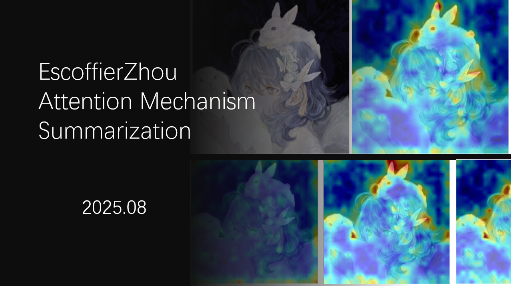

**参考`Paper with code`**

## 1.基本的Attention

**自注意力(Self Attention) vs. 目标注意力 (Target Attention)**

**软注意力 (Soft Attention) vs. 硬注意力 (Hard Attention)**

**全局注意力 (Global Attention) vs. 局部注意力 (Local Attention)**

**多头注意力 (Multi-head Attention)**

## 2.自注意力与Transformer

## 3.CV中的Attention

## 4.Attention间的fusion

## 5.前沿Attention
