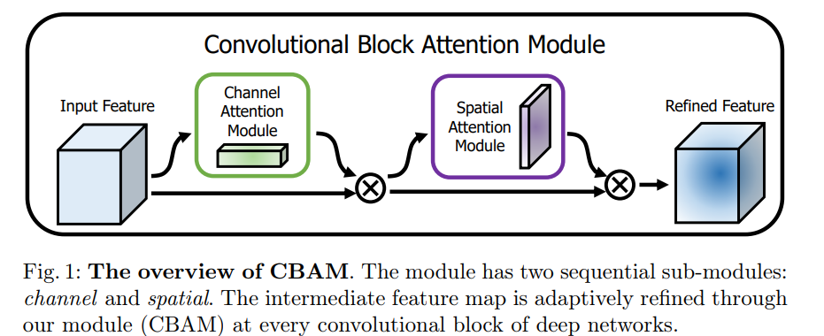
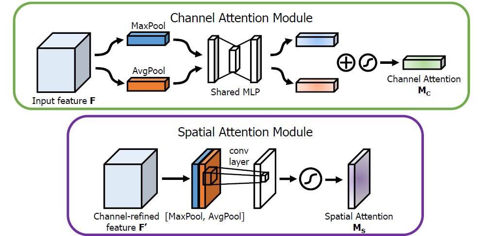
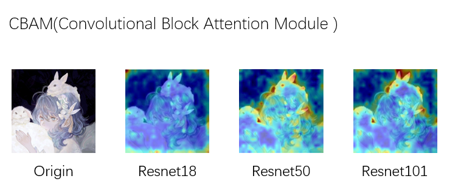

# CBAM: Convolutional Block Attention Module

*ECCV 2018*





## **Abstract**

>   We propose Convolutional Block Attention Module (CBAM), a simple yet effective attention module for feed-forward convolutional neural networks. Given an intermediate feature map, our module sequentially infers attention maps along two separate dimensions, channel and spatial, then the attention maps are multiplied to the input feature map for adaptive feature refinement. Because CBAM is a lightweight and general module, it can be integrated into any CNN architectures seamlessly with negligible overheads and is end-to-end trainable along with base CNNs. We validate our CBAM through extensive experiments on ImageNet-1K, MS~COCO detection, and VOC~2007 detection datasets. Our experiments show consistent improvements in classification and detection performances with various models, demonstrating the wide applicability of CBAM. The code and models will be publicly available.
>
>   我们提出了卷积块注意力模块（CBAM），这是一个简单但有效的用于前馈卷积神经网络的注意力模块。给定一个中间特征图，**<font color=Deeppink>我们的模块沿两个独立的维度——通道和空间——顺序推断注意力图，然后将注意力图乘以输入特征图以进行自适应特征细化。</font>**由于 CBAM 是一个轻量级且通用的模块，它可以无缝集成到任何 CNN 架构中，开销可以忽略不计，并且可以与基础 CNN 一起进行端到端的训练。我们通过在 ImageNet-1K、MS~COCO 检测和 VOC~2007 检测数据集上进行大量实验验证了我们的 CBAM。我们的实验表明，在各种模型中，分类和检测性能都得到了一致的提升，这证明了 CBAM 的广泛适用性。代码和模型将公开提供。

**Advantages**

>   **1.从通道和空间两个维度进行学习**
>
>   **2.适用于所有CNN架构(无缝衔接)**

## Code

```python
class ChannelAttention(nn.Module):
    def __init__(self, in_planes, ratio=16):
        super(ChannelAttention, self).__init__()
        reduced = max(1, in_planes // ratio)
        self.avg_pool = nn.AdaptiveAvgPool2d(1)
        self.max_pool = nn.AdaptiveMaxPool2d(1)
        self.shared_MLP = nn.Sequential(
            nn.Conv2d(in_planes, reduced, 1, bias=False),
            nn.ReLU(),
            nn.Conv2d(reduced, in_planes, 1, bias=False)
        )
        self.sigmoid = nn.Sigmoid()

    def forward(self, x):
        avg_out = self.shared_MLP(self.avg_pool(x))
        max_out = self.shared_MLP(self.max_pool(x))
        return self.sigmoid(avg_out + max_out)


class SpatialAttention(nn.Module):
    def __init__(self, kernel_size=7):
        super(SpatialAttention, self).__init__()
        self.conv = nn.Conv2d(2, 1, kernel_size=kernel_size, padding=kernel_size//2, bias=False)
        self.sigmoid = nn.Sigmoid()

    def forward(self, x):
        avg = torch.mean(x, dim=1, keepdim=True)
        max, _ = torch.max(x, dim=1, keepdim=True)
        x_cat = torch.cat([avg, max], dim=1)
        return self.sigmoid(self.conv(x_cat))


class CBAM(nn.Module):
    def __init__(self, in_planes, ratio=16, kernel_size=7):
        super(CBAM, self).__init__()
        self.ca = ChannelAttention(in_planes, ratio)
        self.sa = SpatialAttention(kernel_size)

    def forward(self, x):
        ca = self.ca(x)
        x_ca = x * ca
        sa = self.sa(x_ca)
        x_sa = x_ca * sa
        out = x_sa + x  # 残差连接
        return x_sa, out  # 返回注意力处理结果 & 残差结果
```

## Result

使用Pretrained的系列模型,设置固定种子`torch.manual_seed(51)`

